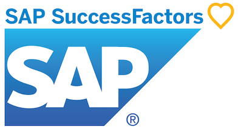

## Introduction
User research is a crucial part of designing and developing accessible products and services. 
In this case study, we will share how IAccessible and SAP, a global leader in enterprise software, collaborated to conduct user research with people with disabilities for SAP's cloud-based human resources solution, SAP SuccessFactors.

## challenges
Conducting user research with people with disabilities can pose some unique challenges, such as:
* Finding and recruiting participants
* Ensuring ethical and inclusive practices
* Adapting research methods to different needs and preferences.
* Describing user interface designs for blind and low vision reviewers in sufficient detail to allow them to give meaningful feedback.
* Asking the right set of questions that allow participants with different disabilities to provide feedback pertanent to the assistive tools and technologies they use.

## Goals
The goal of the user research was to understand if a new card-based UI widget in SuccessFactors will be usable for people with disabilities.
 SAP wanted to identify any pain points as they were designing this new interface. 
 The goal was to include 12 participants with different types of disabilities:
 * Blindness
 * low vision
 * cognitive disabilities -- dislexia
* Motor disabilities

## Process
The user research process consisted of four main phases: planning, recruitment, execution, and analysis. In each phase, IAccessible and SAP worked closely together to ensure a successful and respectful collaboration with the participants.

- Planning: In this phase, IAccessible and SAP defined the research objectives, questions, methods, and tools. They decided to use a combination of structured interviews and questions in the "accessibility usability scale" to collect both qualitative and quantitative data. 
IAccessible helped the SAP researchers create detailed descriptions for the user widget mockups that were to be reviewed for the blind and low vision reviewers.
Additionally, we prepared the consent forms, the compensation policy, and the accessibility guidelines for the research sessions.
- Recruitment: In this phase, IAccessible used its network of contacts and organizations to find and recruit participants who met the criteria for the user research. We contacted potential participants via email or phone, explained the purpose and scope of the research, and screened them for eligibility. We also asked them about their availability, preferences, and accessibility requirements for the research sessions.
- Execution: In this phase, IAccessible and SAP conducted the research sessions with the participants. The sessions were held remotely via Teams. Each session lasted about an hour and was facilitated by two researchers: one from IAccessible and one from SAP. The researchers followed a semi-structured script that covered the introduction, the consent form, the interview questions, the usability test tasks, and the closing remarks. The researchers also used screen sharing, audio recording, video recording, and note-taking tools to capture the data.

## Outcomes
The user research resulted in a comprehensive report that included personas, journey maps, pain points, needs, opportunities, and suggestions for improvement. The report provided valuable feedback and guidance for SAP to enhance its solution design and development.

## Learnings
The user research project was a valuable learning experience for both IAccessible and SAP. We gained a deeper understanding of how people with disabilities use SAP SuccessFactors, what are their challenges and expectations, and how SAP can meet their needs. We also established a trusting and respectful relationship with the participants, who expressed their appreciation for being involved in the research process.
Most importantly, we learned a lot about what kind of questions make most sense for each disability and what research method adaptations are useful in each case.

## conclusion
By collaborating with IAccessible, SAP demonstrated its commitment to accessibility and inclusion as core values of its business strategy. By conducting user research with people with disabilities, SAP ensured that its solution design and development are informed by real users' feedback and perspectives. By sharing this case study, we hope to inspire other organizations to follow this example and conduct user research with people with disabilities as part of their accessibility journey.