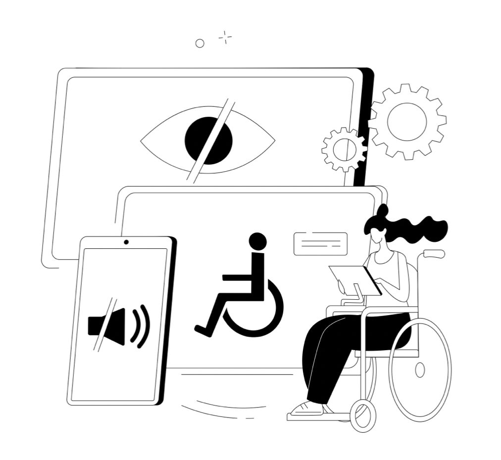

---
# Feel free to add content and custom Front Matter to this file.
# To modify the layout, see https://jekyllrb.com/docs/themes/#overriding-theme-defaults
title: IAccessible
layout: splash
intro: 
  - title : "People with disabilities power accessibility in your products"
    excerpt: 'Leading organizations use IAccessible to connect to people with disabilities for accessibility testing, training, and design reviews.'
goal:
  - excerpt: >
      Our mission is to help companies build accessible and inclusive products through the power of design, reviews, testing, and training by users with disabilities. We do this by collaborating with non- profit organizations across the world to train and hire people with various kinds of disabilities. Besides being trained experts in accessibility testing and design, they have a lifetime of experience as users of accessibility products and solutions for their day-to-day living.

customers:
  - image_path : "assets/images/SAP_logo.png"
    image_width : '124'
    image_height: '121'
    alt : "SAP logo"
    featuretitle: "IAccessible helps SAP conduct inclusive user research"
    url: "/case-studies/SAP"
    btn_label : "SAP case study"
    excerpt: |
      IAccessible and SAP, a global leader in enterprise software, collaborated to conduct user research with people with disabilities for SAP's cloud-based human resources solution, SAP SuccessFactors. The research helped SAP not just build a more inclusive product but also helped lay down a blueprint for their inlcusive user research program.
#  - image_path : "assets/images/Adobe_logo.png"
#    image_width : '124'
#    image_height: '121'
#    alt : "Adobe logo"
#    featuretitle: "IAccessible and Adobe Collaborate #to Make the Universal Editor More Inclusive"
#    url: "/case-studies/adobe"
#    btn_label : "Adobe case study"
#    excerpt: |
#      IAccessible is working with Adobe to make the #Universal Editor more inclusive for assistive #technology users by designing a more accessible and #efficient Selection Tool. The goal is to create a #product with input from users with disabilities at #every stage of development. The project demonstrates #the value of designing with people with disabilities #in mind.
  - image_path : "assets/images/microsoft-logo.PNG"
    image_width : '124'
    image_height: '121'
    alt : "microsoft logo"
    featuretitle: "IAccessible Helps Compass Group Enhance Accessibility in Microsoft Cafes"
    url: "case-studies/microsoft"
    btn_label : "Microsoft case study"
    excerpt: |
      IAccessible is partnering with Compass Group USA to improve the accessibility of their innovations in Microsoft cafes and dining facilities. From vending machines to the Rammon vending car, we are helping Compass Group gather valuable feedback from real users with disabilities to ensure their innovations are ready for deployment and meet the needs of all employees.

services:
  - image_path : "assets/images/assessment.jpg"
    image_width : '124'
    image_height: '121'
    featuretitle: "Get an accessibility assessment"
    url: "assessment"
    btn_label : "More about assessments"
    excerpt: |
      Use a team of expert assistive technology users with lived experience of disabilities to assess your web and mobile applications against WCAG 2.1 & section 508 standards for compliance.
  - image_path : "assets/images/VPAT.jpg"
    image_width : '124'
    image_height: '121'
    featuretitle: "Get a VPAT report"
    url: "assessment#showcase-your-accessibility-conformance-with-standardized-reports"
    btn_label : "More about VPATs"
    excerpt: |
      We create VPAT reports to showcase the accessibility conformance of your application . Our VPAT reports provide results against Section 508, WCAG 2.1, and EN 341 549 European standard. 

other_services:
  - image_path : "assets/images/experience.jpg"
    image_width : '124'
    image_height: '121'
    url: "design"
    btn_label : "More about design reviews"
    featuretitle: Design accessible experiences
    excerpt: |
      Did you know, you can prevent 60% of accessibility bugs during the design of your applications?  
      Build an accessible and usable   product  right the first time and save costly bug fixes later.
  - image_path : "assets/images/expert.jpg"
    image_width : '124'
    image_height: '121'
    url: "trainings"
    btn_label : "More about trainings"
    featuretitle: Become an accessibility expert
    excerpt: |
      Sign-up for our workshops and hands-on training on how to create accessible web and mobile applications. We customize them to your specific needs and meet the learners where they are.

author_profile: false
---

    

  

    

    

      

        

          <h1 class="archive__item-body_2_h1">People with disabilities power accessibility in your products</h1>
          <a href="/contact-us" style="text-decoration: none;">

            
Free Assessment

          </a>
         
        

          
      

        

    
      

      
    

  

  <!-- <h2 class="archive__item-body_8_h1">Get started on your accessibility journey</h2>
  <article class="splash" itemscope itemtype="https://schema.org/CreativeWork">
    <meta itemprop="headline" content="IAccessible">
    <meta itemprop="description" content="People with disabilities power accessibility in your products">
    
    

    <section class="page__content" itemprop="text">

  
    

      

        
          

            
            
          

        

        

          
            <h3 class="archive__item-title">Get an accessibility assessment</h3>
          

          
            

              
Use a team of expert assistive technology users with lived experience of disabilities to assess your web and mobile applications against WCAG 2.1 &amp; section 508 standards for compliance.

            

          

          
            
<a href="/assessment" class="archive__item-body_2_p" style="text-decoration: none;color: #fff;">More about assessments</a>

          
        

      

    

  
    

      

        
          

            
            
          

        

        

          
            <h3 class="archive__item-title">Get a VPAT report</h3>
          

          
            

              
We create VPAT reports to showcase the accessibility conformance of your application . Our VPAT reports provide results against Section 508, WCAG 2.1, and EN 341 549 European standard.

            

          

          
            
<a href="/assessment#showcase-your-accessibility-conformance-with-standardized-reports" class="archive__item-body_2_p" style="text-decoration: none;color: #fff;">More about VPATs</a>

          
        

      

    

  

  
    

      

        
          

            
            
          

        

        

          
            <h3 class="archive__item-title">Design accessible experiences</h3>
          

          
            

              
Did you know, you can prevent 60% of accessibility bugs during the design of your applications? 
Build an accessible and usable   product  right the first time and save costly bug fixes later.

            

          

          
            
<a href="/design" class="archive__item-body_2_p" style="text-decoration: none;color: #fff;">More about design reviews</a>

          
        

      

    

  
    

      

        
          

            
            
          

        

        

          
            <h3 class="archive__item-title">Become an accessibility expert</h3>
          

          
            

              
Sign-up for our workshops and hands-on training on how to create accessible web and mobile applications. We customize them to your specific needs and meet the learners where they are.

            

          

          
            
<a href="/trainings" class="archive__item-body_2_p" style="text-decoration: none;color: #fff;">More about trainings</a>

          
        

      

    

  

<h2 class="archive__item-body_8_h1">Join us to empower people with disabilities</h2>

  
 
    
  

  

    

      Our mission is to help companies build accessible
  and inclusive products through the power of design,
  reviews, testing, and training by users with disabilities. We do this by collaborating with non- profit organizations across the world to train and hire people with various kinds of disabilities. Besides being trained experts in accessibility testing and
  design, they have a lifetime of experience as users of accessibility products and solutions for their day-to-day living.
    

    <a href="/about-us" style="text-decoration: none;">
      
Our Story

    </a>
  

    </section>
  </article>
--> 




<h2 class="archive__item-body_8_h1">Join us to empower people with disabilities</h2>

  
 
    
  

  

    

      Our mission is to help companies build accessible
  and inclusive products through the power of design,
  reviews, testing, and training by users with disabilities. We do this by collaborating with non- profit organizations across the world to train and hire people with various kinds of disabilities. Besides being trained experts in accessibility testing and
  design, they have a lifetime of experience as users of accessibility products and solutions for their day-to-day living.
    

    <a href="/about-us" style="text-decoration: none;">
      
Our Story

    </a>
  



<figure class="third " style="padding: 12px 16px;" >

  

    
    
SAP SuccessFactors
  
    <!-- 
Read more about our design journey with Eskalera.

     -->
  

  

    
    
Compass group USA
  
    <!-- 
Read more about our partnership with Racloop.

     -->
 
  

     
  

    
    
Saksham
  
    <!-- 
Read more about our accessibility journey with Saksham.

     -->

  

</figure>

